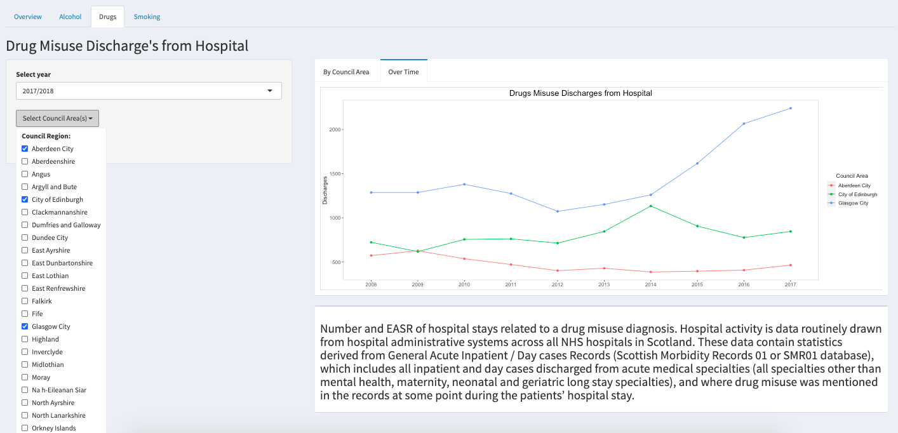
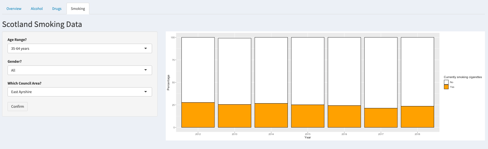

## Introduction
This repository showcases a dashboard app created using R studio and Shiny functionality to explore health data in Scotland.  The team created a dashboard which allowed the user to explore two main health overview topics - Life Expectancy and Life Satisfaction.  The dashboard also allowed exploration of the health issues around smoking, drug and alcohol behaviours. Data was sourced from the Scottish Government.

## Team Members

Our team of four comprised David Currie, Mark Donaldson, Calum Sey and Geraldine Smith, all from CodeClan DE5 Data Analysis cohort.

## Process Methodology
The team used data from the Scottish Government website, which required some cleaning and wrangling. The data sets required levels of filtering in order to allow the user to explore by different variables such as council area, health board, age and gender.

## Packages Used
The main packages used for cleaning were `tidyverse` and `janitor`.  The packages used to manipulate the spacial data were `rgeos`, `sf`, `sp`, and `rgdal` to read the shapefiles.

## App Functionality
The app has four tabs which display data on different topics:

+ General heealth overview using life expectancy and life satisfaction data
+ Alcohol related hospital admissions
+ Drug related hospital discharges 
+ Smoking survey responses

Each tab allows the user to explore the data set by changing variables such as NHS health board, time period, age range and gender.

## Images
### Overview

### Alcohol-related Hospital Admissions

### Drug-related Hospital Discharges

### Smoking Survey Responses

## References

All data was sourced from www.gov.scot. For specific data sets used, please see links below:

1. https://www.gov.scot/binaries/content/documents/govscot/publications/corporate-report/2018/06/scotlands-public-health-priorities/documents/00536757-pdf/00536757-pdf/govscot%3Adocument/00536757.pdf​)
2. https://statistics.gov.scot/resource?uri=http%3A%2F%2Fstatistics.gov.scot%2Fdata%2F Life-Expectancy
3. https://statistics.gov.scot/resource?uri=http%3A%2F%2Fstatistics.gov.scot%2Fdata%2F Scottish-health-survey-local-area-level-data
4. https://statistics.gov.scot/resource?uri=http%3A%2F%2Fstatistics.gov.scot%2Fdata%2F Smoking-sscq
5. https://statistics.gov.scot/resource?uri=http%3A%2F%2Fstatistics.gov.scot%2Fdata%2F Drug-related-discharge
6. https://statistics.gov.scot/resource?uri=http%3A%2F%2Fstatistics.gov.scot%2Fdata%2F Alcohol-related-hospital-statistics

